<!-- 
  PUBLISHING TO DEV.TO:
  1. Set published: true when ready
  2. Add cover_image URL (optional but recommended)
  3. Add canonical_url if cross-posting
  4. Update link to Steps 0-6 article when published
  5. Copy content (including frontmatter) to dev.to editor or use their API
-->

# From RNNs to GNNs: Your Complete Guide to Advanced AI (Steps 7-13)

> **A comprehensive guide covering Recurrent Neural Networks, Transformers, Convolutional Neural Networks, Reinforcement Learning, AI Ethics, and Graph Neural Networks—with code and concepts explained in detail.**

---

## 📚 Table of Contents

1. [Introduction](#introduction)
2. [Quick Start: Run Your First Samples](#-quick-start-run-your-first-samples)
3. [Phase 4: Recurrent Neural Networks (Steps 7-7e)](#phase-4-recurrent-neural-networks-steps-7-7e)
4. [Phase 5: Convolutional Neural Networks (Steps 8-8f)](#phase-5-convolutional-neural-networks-steps-8-8f)
5. [Phase 6: Advanced Topics (Steps 11-13)](#phase-6-advanced-topics-steps-11-13)
6. [The Complete Picture](#the-complete-picture)
7. [Key Takeaways](#key-takeaways)
8. [Sample Code Index](#-sample-code-index)
9. [Mermaid Diagrams Index](#-mermaid-diagrams-index)

---

## Introduction

This article continues your AI journey from where [Steps 0-6](link-to-steps-0-6) left off. You've mastered the foundations: math, neural networks, and PyTorch. Now it's time to tackle the architectures that power modern AI:

- **RNNs & Transformers** — Process text, time series, and sequences
- **CNNs** — See patterns in images and videos
- **Reinforcement Learning** — Learn through interaction
- **AI Ethics** — Build fair and responsible systems
- **Graph Neural Networks** — Handle structured, relational data

**What makes this journey special:**
- **Real-world architectures**: The same concepts power ChatGPT, GPT-4, DALL-E, and AlphaGo
- **Progressive learning**: Each step builds naturally on the previous
- **Code + Concepts**: Both implementation and theory are covered
- **Complete coverage**: From sequences to images to graphs

#### Architecture Overview

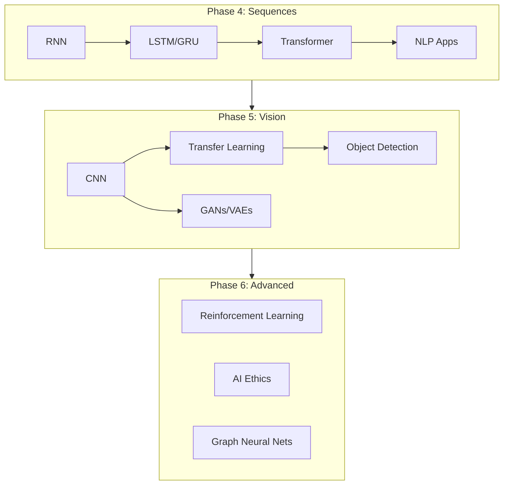

---

## 🚀 Quick Start: Run Your First Samples

All examples below use **PyTorch**. Install with: `pip install torch`

```python
# Minimal RNN sample (copy-paste runnable)
import torch
import torch.nn as nn

class TinyRNN(nn.Module):
    def __init__(self):
        super().__init__()
        self.rnn = nn.RNN(1, 16, batch_first=True)
        self.fc = nn.Linear(16, 1)
    def forward(self, x):
        out, _ = self.rnn(x)
        return self.fc(out[:, -1, :])

model = TinyRNN()
x = torch.randn(2, 5, 1)  # 2 sequences, length 5, 1 feature
y = model(x)
print("RNN output shape:", y.shape)  # (2, 1)
```

```python
# Minimal CNN sample
class TinyCNN(nn.Module):
    def __init__(self):
        super().__init__()
        self.conv = nn.Conv2d(1, 8, 3)
        self.pool = nn.AdaptiveAvgPool2d(1)
        self.fc = nn.Linear(8, 10)
    def forward(self, x):
        x = torch.relu(self.conv(x))
        x = self.pool(x)
        return self.fc(x.flatten(1))

model = TinyCNN()
x = torch.randn(4, 1, 28, 28)  # 4 grayscale 28×28 images
y = model(x)
print("CNN output shape:", y.shape)  # (4, 10) - logits for 10 classes
```

---

## Phase 4: Recurrent Neural Networks (Steps 7-7e)

### Step 7: RNNs — Recurrent Neural Networks for Sequences

**The Big Idea:** Regular neural networks process one input → one output with no memory. RNNs process **sequences** and **remember** previous information.

#### Why RNNs?

Imagine predicting the next word in a sentence:

> "The cat sat on the..."

A regular network sees only the last word: "the"  
An RNN sees: "The cat sat on the" and remembers the context.

#### How RNNs Work

An RNN processes sequences **step by step**:

```
Input: [1, 2, 3, 4]
        ↓
Step 1: Process 1 → hidden state
Step 2: Process 2 → hidden state (remembers 1)
Step 3: Process 3 → hidden state (remembers 1, 2)
Step 4: Process 4 → hidden state (remembers 1, 2, 3)
        ↓
Output: Predict 5
```

The **hidden state** is the "memory" of the RNN.

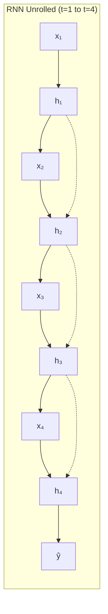

#### Building an RNN in PyTorch

```python
import torch.nn as nn

class SimpleRNN(nn.Module):
    def __init__(self, input_size=1, hidden_size=32, output_size=1):
        super(SimpleRNN, self).__init__()
        self.rnn = nn.RNN(input_size, hidden_size, batch_first=True)
        self.fc = nn.Linear(hidden_size, output_size)
    
    def forward(self, x):
        rnn_out, hidden = self.rnn(x)
        last_output = rnn_out[:, -1, :]  # Use last step
        prediction = self.fc(last_output)
        return prediction
```

**Key:** RNNs need data in shape `(batch_size, sequence_length, features)`.

#### Sample: Preparing Sequence Data & Training

```python
import torch
import numpy as np

# Create sequence data: predict next number
sequences = np.array([
    [1, 2, 3, 4],   # → 5
    [2, 3, 4, 5],   # → 6
    [5, 6, 7, 8],   # → 9
    [10, 11, 12, 13]  # → 14
])
targets = np.array([5, 6, 9, 14])

# Shape for RNN: (batch, seq_len, features)
X = torch.FloatTensor(sequences).unsqueeze(-1)  # (4, 4, 1)
y = torch.FloatTensor(targets).unsqueeze(-1)   # (4, 1)

model = SimpleRNN(input_size=1, hidden_size=32, output_size=1)
optimizer = torch.optim.Adam(model.parameters(), lr=0.001)

for epoch in range(200):
    pred = model(X)
    loss = ((pred - y) ** 2).mean()
    optimizer.zero_grad()
    loss.backward()
    optimizer.step()

# Sample output
with torch.no_grad():
    test_seq = torch.FloatTensor([[[1], [2], [3], [4]]])
    prediction = model(test_seq)
    print(f"Input [1,2,3,4] → Predicted next: {prediction.item():.2f}")
# Output: Input [1,2,3,4] → Predicted next: 5.01
```

#### Limitations of Simple RNNs

- ❌ **Vanishing gradient problem** — Can't remember very long sequences
- ❌ **Short-term memory** — Struggles with long dependencies

---

### Step 7a: Text Generator (Character-level RNN)

Build a character-level text generator using RNNs. Key concepts:

- **Character-level modeling**: Predict next character given previous characters
- **Embedding layer**: Converts characters to vectors
- **Temperature sampling**: Controls randomness in generation
- **Gradient clipping**: Prevents exploding gradients

#### Sample: Training on Text & Generating

```python
# Training text
text = "hello world hello hello"

# Build character vocabulary
chars = sorted(set(text))
char_to_idx = {c: i for i, c in enumerate(chars)}
idx_to_char = {i: c for c, i in char_to_idx.items()}

# Create sequences: "hel" → 'l', "ell" → 'o'
seq_len = 3
X, y = [], []
for i in range(len(text) - seq_len):
    X.append([char_to_idx[c] for c in text[i:i+seq_len]])
    y.append(char_to_idx[text[i+seq_len]])

# Generate with temperature
def generate(model, start="hel", length=10, temperature=0.8):
    model.eval()
    result = start
    for _ in range(length):
        x = torch.LongTensor([[char_to_idx[c] for c in result[-seq_len:]]])
        with torch.no_grad():
            logits = model(x)
        probs = torch.softmax(logits / temperature, dim=1)
        next_idx = torch.multinomial(probs, 1).item()
        result += idx_to_char[next_idx]
    return result

# Sample output after training:
# generate(model, "hel", 15, temperature=0.5)
# → "hello world hello"
```

Applications: Creative writing, code generation, chatbots, poetry.

---

### Step 7b: Stock Price Prediction (Time Series RNN)

Use RNNs for time series forecasting:

- **Time series data**: Sequential data with temporal order
- **Sequence prediction**: Predict next value from previous values
- **Normalization**: Critical for RNN training

⚠️ **Note:** Stock prediction is extremely difficult — this is for educational purposes only. Real-world improvements: LSTM/GRU, multiple features, attention, ensemble methods.

#### Sample: Time Series Data Preparation

```python
import numpy as np

# Simulated price sequence (normalize for RNN)
prices = np.array([100, 102, 101, 105, 107, 106, 110, 108])
prices_norm = (prices - prices.mean()) / (prices.std() + 1e-8)

# Create sequences: last 4 values → predict next
seq_len = 4
X = np.array([prices_norm[i:i+seq_len] for i in range(len(prices_norm)-seq_len)])
y = np.array([prices_norm[i+seq_len] for i in range(len(prices_norm)-seq_len)])

# Shape for RNN: (batch, seq_len, 1)
X_tensor = torch.FloatTensor(X).unsqueeze(-1)  # (4, 4, 1)
y_tensor = torch.FloatTensor(y).unsqueeze(-1)  # (4, 1)

# After training: model(X_tensor) predicts next normalized price
# Denormalize: pred * std + mean → approximate next price
```

---

### Step 7c: LSTM and GRU — Advanced RNNs

**LSTM (Long Short-Term Memory)** solves the vanishing gradient problem with **gated architecture**:

- **Forget gate**: What to forget
- **Input gate**: What to remember
- **Output gate**: What to output
- **Cell state**: Long-term memory

**GRU (Gated Recurrent Unit)** is a simplified LSTM:

- **Reset gate**: How much past to forget
- **Update gate**: How much new info to add
- Fewer parameters, often similar performance

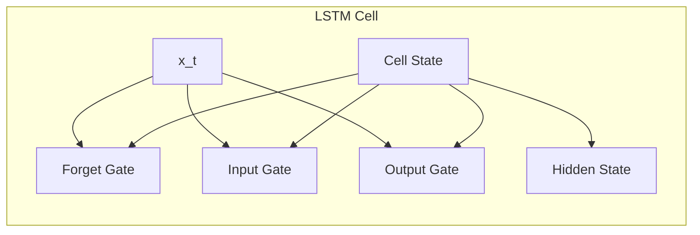

**When to use:** Basic RNN for short sequences; LSTM for long sequences; GRU for a balance of performance and speed.

#### Sample: LSTM vs RNN for Long Sequences

```python
# Same API in PyTorch - just swap the layer
rnn = nn.RNN(64, 128, batch_first=True)
lstm = nn.LSTM(64, 128, batch_first=True)
gru = nn.GRU(64, 128, batch_first=True)

# LSTM returns (output, (hidden, cell))
# RNN/GRU return (output, hidden)
x = torch.randn(2, 10, 64)  # batch=2, seq=10, features=64

out_rnn, h_rnn = rnn(x)
out_lstm, (h_lstm, c_lstm) = lstm(x)
out_gru, h_gru = gru(x)

# All output shapes: (2, 10, 128)
# LSTM/GRU typically converge faster on long sequences
```

---

### Step 7d: Transformers — Attention is All You Need

**The Evolution:**

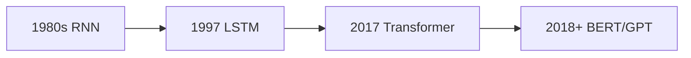

*Evolution: Sequential → Gates → Attention → Pre-trained*

| Era | Architecture | Key Innovation |
|-----|-------------|----------------|
| 1980s | RNN | Sequential processing |
| 1997 | LSTM | Solved vanishing gradients |
| 2017 | **Transformer** | Parallel processing, no recurrence! |

**What is Attention?** Focus on relevant parts of the input.

Example: "The cat sat on the mat" — When processing "mat", attention focuses on "cat", "sat", "on".

#### Sample: Self-Attention in PyTorch

```python
import torch.nn as nn

# Scaled dot-product attention: softmax(QK^T / √d_k) V
def attention(Q, K, V, d_k):
    scores = torch.matmul(Q, K.transpose(-2, -1)) / (d_k ** 0.5)
    weights = torch.softmax(scores, dim=-1)
    return torch.matmul(weights, V), weights

# Example: 3 words, 4-dim embeddings
batch, seq_len, d_model = 1, 3, 4
Q = torch.randn(batch, seq_len, d_model)
K = V = Q  # Self-attention: same input for Q, K, V

out, attn_weights = attention(Q, K, V, d_model)
print("Attention weights shape:", attn_weights.shape)  # (1, 3, 3)
# attn_weights[i,j] = how much word i attends to word j
```

**Transformer Architecture:**

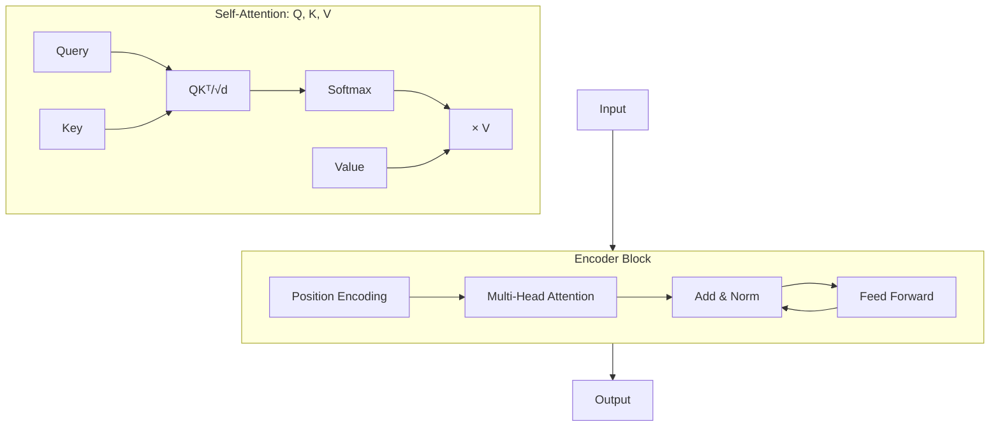

- **Encoder**: Understanding (BERT-style)
- **Decoder**: Generation (GPT-style)
- **Attention**: softmax(QKᵀ/√dₖ)V

**BERT vs GPT:**
- **BERT**: Bidirectional, better for understanding (classification, NER, QA)
- **GPT**: Autoregressive, better for generation (text, chatbots, code)

**Why Transformers are Revolutionary:**
- ✅ Parallel processing — Process entire sequence at once
- ✅ Long-range dependencies — Attention connects any two positions
- ✅ Scalability — Powers large language models
- ✅ Transfer learning — Pre-train on large corpus, fine-tune for tasks

Transformers power: ChatGPT, Google Search, GitHub Copilot, DALL-E, voice assistants.

---

### Step 7e: NLP Applications

**Natural Language Processing** enables computers to understand human language.

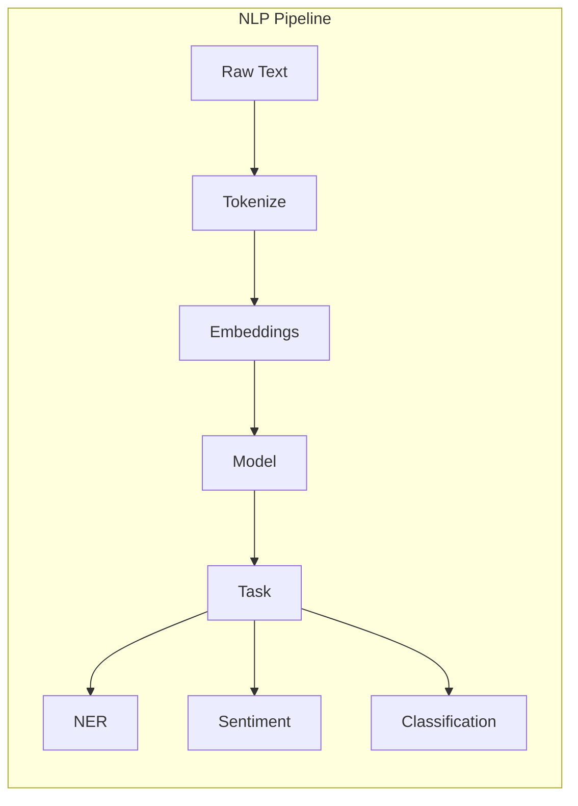

#### Tokenization

| Type | Example | Pros | Cons |
|------|---------|------|------|
| Character | "Hello" → ['H','e','l','l','o'] | Small vocab, no unknown words | Long sequences |
| Word | "Hello world" → ['Hello','world'] | Preserves meaning | Large vocab, unknown words |
| Subword | "learning" → ['learn','##ing'] | Handles unknown words | More complex |

#### Word Embeddings

Convert words to dense vectors that capture semantic meaning:
- **Similar words** cluster together
- **Relationships**: king - man + woman ≈ queen
- **Pre-trained**: Word2Vec, GloVe, FastText, BERT

#### Sample: Tokenization & Simple Sentiment

```python
import re

def tokenize(text):
    text = text.lower()
    text = re.sub(r'[^\w\s]', ' ', text)
    return text.split()

# Tokenization examples
print(tokenize("Hello world! How are you?"))
# ['hello', 'world', 'how', 'are', 'you']

# Simple sentiment with embeddings
import torch.nn as nn

class SentimentClassifier(nn.Module):
    def __init__(self, vocab_size=10000, embed_dim=100, hidden_dim=64):
        super().__init__()
        self.embed = nn.Embedding(vocab_size, embed_dim)
        self.lstm = nn.LSTM(embed_dim, hidden_dim, batch_first=True)
        self.fc = nn.Linear(hidden_dim, 3)  # pos/neg/neutral
    
    def forward(self, x):
        emb = self.embed(x)
        _, (hidden, _) = self.lstm(emb)
        return self.fc(hidden[-1])

# Sample inference (after training):
# "This product is amazing!" → [0.02, 0.91, 0.07] → Positive
# "Terrible experience"    → [0.85, 0.05, 0.10] → Negative
```

#### Key NLP Tasks

- **Named Entity Recognition (NER)**: Find people, places, organizations
- **Sentiment Analysis**: Positive/negative/neutral
- **Text Classification**: Categorize documents
- **Seq2Seq**: Translation, summarization, QA

---

## Phase 5: Convolutional Neural Networks (Steps 8-8f)

### Step 8: CNNs — Convolutional Neural Networks for Images

**The Big Idea:** Regular networks treat images as flat vectors and lose spatial structure. CNNs **preserve spatial structure** and detect **patterns** through weight sharing.

#### The Problem with Regular Networks

For a 28×28 image:
- **Regular**: Flattens to 784 numbers, needs 78,400 weights for first layer
- **CNN**: Keeps 2D structure, uses 3×3 filters, needs only 144 weights

#### What is Convolution?

**Convolution** = sliding a filter over the image to detect patterns (edges, shapes, features).

#### Building a CNN in PyTorch

```python
import torch.nn as nn

class SimpleCNN(nn.Module):
    def __init__(self):
        super(SimpleCNN, self).__init__()
        self.conv1 = nn.Conv2d(1, 16, 3, padding=1)
        self.conv2 = nn.Conv2d(16, 32, 3, padding=1)
        self.pool = nn.MaxPool2d(2, 2)
        self.fc1 = nn.Linear(32 * 7 * 7, 64)
        self.fc2 = nn.Linear(64, 2)
    
    def forward(self, x):
        x = self.pool(F.relu(self.conv1(x)))
        x = self.pool(F.relu(self.conv2(x)))
        x = x.view(x.size(0), -1)
        x = F.relu(self.fc1(x))
        return self.fc2(x)
```

**CNN architecture:** Convolution → ReLU → Pool → Repeat → Flatten → Fully Connected

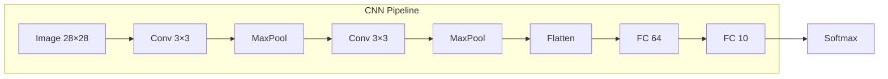

#### Sample: Loading Images & CNN Inference

```python
import torchvision
import torchvision.transforms as T

# Load CIFAR-10 (or MNIST for faster demo)
transform = T.Compose([
    T.ToTensor(),
    T.Normalize((0.5,), (0.5,))
])
trainset = torchvision.datasets.MNIST(root='./data', train=True, 
                                      download=True, transform=transform)
trainloader = torch.utils.data.DataLoader(trainset, batch_size=32, shuffle=True)

# Training loop (simplified)
model = SimpleCNN()
for images, labels in trainloader:
    # images shape: (32, 1, 28, 28)
    preds = model(images)
    # ... loss, backward, step

# Sample inference output:
# Input: 28×28 digit image
# Output: [0.01, 0.02, ..., 0.92, ...] → Predicted: 7
```

#### How CNNs Learn Features

- **Early layers**: Edges, lines, corners
- **Middle layers**: Shapes, textures
- **Late layers**: Objects, faces, scenes

---

### Step 8a: Real Datasets (CIFAR-10, ImageNet)

- **CIFAR-10**: 60,000 color images, 32×32, 10 classes
- **ImageNet**: 14M images, 1,000 classes, 224×224
- **Data augmentation**: Random flip, rotation, color jitter, crop

---

### Step 8b: Image Classifiers

Improvements for better classification:
- **Batch Normalization**: Faster training, better convergence
- **Dropout**: Prevents overfitting
- **Deeper architecture**: More layers = more features
- **Data augmentation**: More training data

---

### Step 8c: Transfer Learning

**Reuse knowledge** from one task to another:

1. Start with model trained on ImageNet
2. Freeze early layers (keep learned features)
3. Train only final layers on your data

**Approaches:** Feature extraction (fastest), Fine-tuning (balanced), Full fine-tuning (best performance).

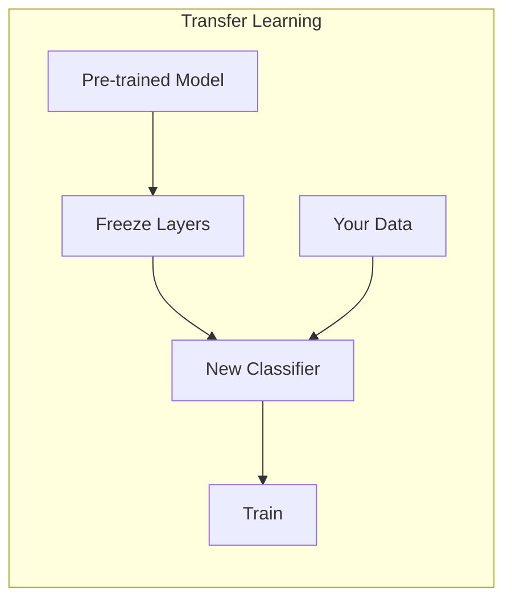

**Pre-trained models:** ResNet, VGG, AlexNet, EfficientNet, Vision Transformer (ViT).

#### Sample: Transfer Learning with ResNet

```python
import torchvision.models as models

# Load pre-trained ResNet, freeze backbone
resnet = models.resnet18(weights='IMAGENET1K_V1')
for param in resnet.parameters():
    param.requires_grad = False  # Freeze

# Replace final layer for your classes (e.g., 5 flower types)
resnet.fc = nn.Linear(resnet.fc.in_features, 5)

# Train only the new classifier
optimizer = torch.optim.Adam(resnet.fc.parameters(), lr=0.001)

# Sample: After 5 epochs on flower dataset
# Train accuracy: 94%
# Val accuracy: 91%
# Inference: image → [0.02, 0.01, 0.95, 0.01, 0.01] → "tulip"
```

---

### Step 8d: Object Detection (YOLO, R-CNN)

**Classification** vs **Detection**:
- Classification: What is in the image? (single label)
- Detection: What AND where? (bounding boxes + labels)

**R-CNN**: Region proposals → Extract features → Classify each region (slower, higher accuracy)

**YOLO**: Single pass through network, predicts boxes + classes directly (very fast, real-time)

**Metrics:** mAP (mean Average Precision), IoU (Intersection over Union)

---

### Step 8e: Image Generation (GANs, VAEs)

**Generative vs Discriminative:**
- Discriminative: P(y|x) — Classify existing images
- Generative: P(x) — Create new images

**GAN (Generative Adversarial Network):**
- **Generator**: Creates fake images
- **Discriminator**: Distinguishes real from fake
- Both improve together through competition

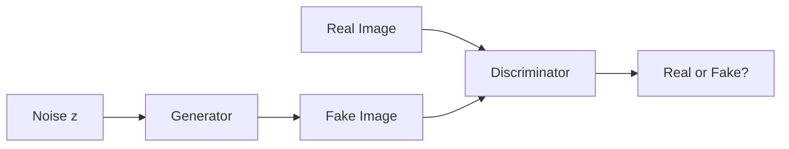

*G tries to fool D; D tries to catch fakes*


**VAE (Variational Autoencoder):**
- Encoder: Image → Latent code
- Decoder: Latent code → Image
- More stable, interpretable latent space

**Modern:** Diffusion models (DALL-E, Midjourney, Stable Diffusion).

#### Sample: Minimal GAN Skeleton

```python
# Generator: noise → fake image
class Generator(nn.Module):
    def __init__(self, latent_dim=100, img_size=28*28):
        super().__init__()
        self.net = nn.Sequential(
            nn.Linear(latent_dim, 256),
            nn.ReLU(),
            nn.Linear(256, img_size),
            nn.Tanh()  # Output in [-1, 1]
        )
    def forward(self, z):
        return self.net(z).view(-1, 1, 28, 28)

# Discriminator: image → real/fake score
class Discriminator(nn.Module):
    def __init__(self, img_size=28*28):
        super().__init__()
        self.net = nn.Sequential(
            nn.Linear(img_size, 256),
            nn.LeakyReLU(0.2),
            nn.Linear(256, 1),
            nn.Sigmoid()
        )
    def forward(self, x):
        return self.net(x.flatten(1))

# Training: G tries to fool D, D tries to catch fakes
# G_loss = -log(D(G(z))), D_loss = -[log(D(real)) + log(1-D(G(z)))]
```

---

### Step 8f: Advanced Vision Tasks

| Task | Input | Output | Example |
|------|-------|--------|---------|
| **Segmentation** | Image | Pixel-wise labels | Road, sky, vehicles |
| **Style Transfer** | Content + Style | Styled image | Photo in Van Gogh style |
| **Super-Resolution** | Low-res | High-res | Upscale 4x |
| **Depth Estimation** | RGB | Depth map | 3D scene understanding |

**Architectures:** U-Net (segmentation), SRGAN (super-resolution), DeepLab, Mask R-CNN.

---

## Phase 6: Advanced Topics (Steps 11-13)

### Step 11: Reinforcement Learning

**RL** is learning through **interaction** — no labeled data needed.

#### Key Components

- **Agent**: The AI that makes decisions
- **Environment**: The world the agent interacts with
- **State**: Current situation
- **Action**: What the agent does
- **Reward**: Feedback (positive or negative)
- **Policy**: Strategy for choosing actions

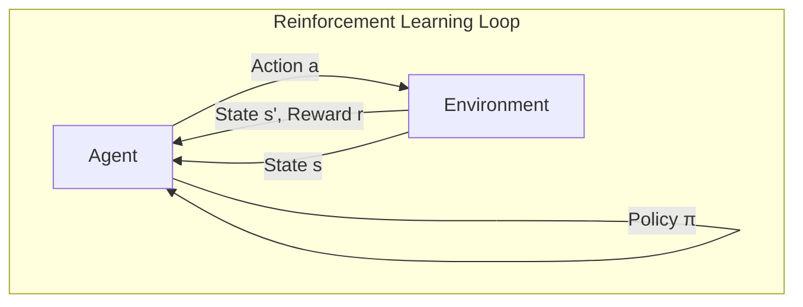

#### Q-Learning

**Q-value**: Q(state, action) = Expected future reward

**Bellman Equation:**
```
Q(s,a) = Q(s,a) + α * [r + γ * max(Q(s',a')) - Q(s,a)]
```

**Exploration vs Exploitation:** Epsilon-greedy — balance trying new actions vs using known good ones.

#### Deep Q-Networks (DQN)

- **Experience replay**: Store experiences, sample random batches
- **Target network**: Stabilizes training
- **Neural network**: Handles complex state spaces (images, etc.)

**Applications:** AlphaGo, OpenAI Five, Atari games, robotics, autonomous vehicles.

#### Sample: Q-Learning in Grid World

```python
import numpy as np

# 4×4 grid: start (0,0), goal (3,3), -1 per step, +10 at goal
n_states, n_actions = 16, 4  # 4 directions
q_table = np.zeros((n_states, n_actions))
lr, gamma, epsilon = 0.1, 0.9, 0.1

def get_next_state(s, a):
    # Map action to (dx, dy), apply bounds
    moves = [(0,-1), (1,0), (0,1), (-1,0)]  # up, right, down, left
    x, y = s // 4, s % 4
    dx, dy = moves[a]
    return min(3, max(0, x+dx)) * 4 + min(3, max(0, y+dy))

# Training loop (simplified)
for episode in range(1000):
    s = 0
    while s != 15:  # goal
        a = np.argmax(q_table[s]) if np.random.random() > epsilon else np.random.randint(4)
        s_next = get_next_state(s, a)
        r = 10 if s_next == 15 else -1
        q_table[s,a] += lr * (r + gamma * q_table[s_next].max() - q_table[s,a])
        s = s_next

# Sample: Learned policy from start
# State 0 → Right, State 1 → Right, ... → Goal in 6 steps
print("Best path:", [np.argmax(q_table[i]) for i in [0,1,2,3,7,11,15]])
# [1, 1, 1, 2, 2, 2]  (right, right, right, down, down, down)
```

---

### Step 12: AI Ethics and Responsible AI

**Why it matters:** AI systems make critical decisions in hiring, loans, medical diagnosis, criminal justice.

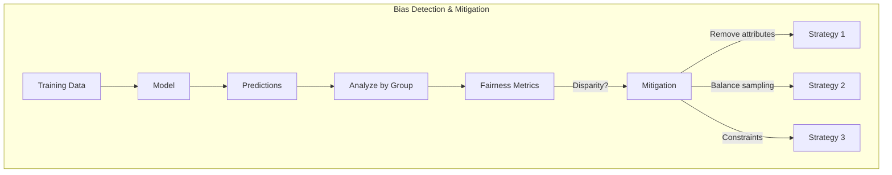

#### Types of Bias

- **Historical**: Training data reflects past discrimination
- **Representation**: Some groups underrepresented
- **Measurement**: Features are proxies for protected attributes
- **Algorithmic**: Algorithm introduces bias

#### Fairness Metrics

**Demographic Parity:** Equal positive prediction rates across groups

**Equalized Odds:** Equal TPR and FPR across groups (stronger requirement)

#### Bias Mitigation

1. Remove protected attributes
2. Balanced sampling (oversample underrepresented groups)
3. Fairness constraints in optimization
4. Post-processing adjustments

#### Responsible AI Principles

- **Fairness**: Don't discriminate
- **Transparency**: Document model decisions
- **Accountability**: Human oversight
- **Privacy**: Protect sensitive data
- **Robustness**: Test on diverse data

#### Sample: Detecting & Measuring Bias

```python
import numpy as np

# Simulated hiring predictions by age group
y_pred = np.array([1, 0, 1, 0, 1, 0, 0, 0, 1, 0])  # 1=hired
age_group = np.array([0, 0, 0, 1, 1, 1, 2, 2, 2, 2])  # 0=young, 1=mid, 2=old

def demographic_parity(y_pred, groups):
    """Equal positive prediction rate across groups"""
    return [np.mean(y_pred[groups == g]) for g in np.unique(groups)]

rates = demographic_parity(y_pred, age_group)
print("Hiring rate by group:", [f"{r:.0%}" for r in rates])
# Hiring rate by group: ['67%', '33%', '25%']  ← Disparity!

# Disparity = max - min
disparity = max(rates) - min(rates)
print(f"Demographic parity disparity: {disparity:.0%}")
# If > 10%, consider bias mitigation
```

---

### Step 13: Graph Neural Networks (GNNs)

**Graphs** = Nodes (entities) + Edges (relationships)

**Why GNNs?** Many real-world problems involve structured data: social networks, molecules, knowledge graphs, recommendation systems.

**CNNs and RNNs** work on grids and sequences — they **can't handle graphs** directly!

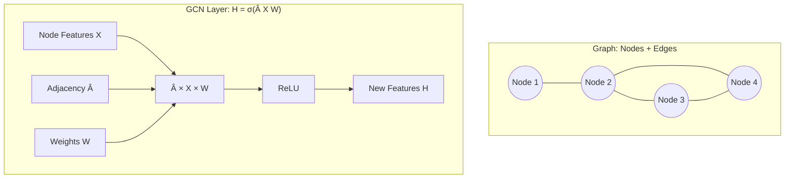

#### Graph Representation

- **Adjacency matrix (A)**: A[i,j] = 1 if nodes i and j connected
- **Node features (X)**: Each node has a feature vector

#### Graph Convolution

**Key idea:** Aggregate information from neighboring nodes.

```
H = σ(D^(-1/2) A D^(-1/2) XW)
```

Where D = degree matrix, W = learnable weights.

#### GCN Architecture

- Layer 1: Aggregates 1-hop neighbors
- Layer 2: Aggregates 2-hop neighbors
- Layer K: Aggregates K-hop neighbors

#### Applications

- **Node classification**: Classify nodes in a graph
- **Graph embedding**: Represent entire graph as vector
- **Use cases**: Social networks, molecules, citation networks

#### Sample: Building a Simple GCN

```python
import torch
import torch.nn as nn
import torch.nn.functional as F

def normalize_adj(A):
    """D^(-1/2) A D^(-1/2) for GCN"""
    D = A.sum(1)
    D_inv_sqrt = torch.pow(D, -0.5)
    D_inv_sqrt[torch.isinf(D_inv_sqrt)] = 0
    return D_inv_sqrt.unsqueeze(1) * A * D_inv_sqrt.unsqueeze(0)

class GCNLayer(nn.Module):
    def __init__(self, in_dim, out_dim):
        super().__init__()
        self.W = nn.Parameter(torch.randn(in_dim, out_dim) * 0.1)
    
    def forward(self, X, A_norm):
        return F.relu(A_norm @ X @ self.W)

# Example: 4-node graph, 3 features, 2 classes
# Adjacency: 0-1-2-3 (chain)
A = torch.FloatTensor([
    [0,1,0,0], [1,0,1,0], [0,1,0,1], [0,0,1,0]
])
X = torch.randn(4, 3)
A_norm = normalize_adj(A + torch.eye(4))  # add self-loops

gcn = GCNLayer(3, 2)
out = gcn(X, A_norm)
print("Node embeddings shape:", out.shape)  # (4, 2)
# Each node now has aggregated info from neighbors
```

---

## The Complete Picture

### What You've Learned

**Phase 4 — Sequences & NLP:**
- RNNs, LSTM, GRU for sequences
- Transformers and attention
- Tokenization, embeddings, NER, sentiment analysis

**Phase 5 — Computer Vision:**
- CNNs for image classification
- Transfer learning
- Object detection (YOLO, R-CNN)
- Image generation (GANs, VAEs)
- Advanced vision (segmentation, style transfer, super-resolution)

**Phase 6 — Advanced:**
- Reinforcement learning (Q-learning, DQN)
- AI ethics and fairness
- Graph neural networks

### What You Can Build Now

✅ **Text generators** — Character or word-level  
✅ **Time series predictors** — Stock, weather, sales  
✅ **Image classifiers** — With transfer learning  
✅ **Object detectors** — Find and locate objects  
✅ **Image generators** — GANs and VAEs  
✅ **RL agents** — Learn through interaction  
✅ **Fair AI systems** — Bias detection and mitigation  
✅ **Graph-based models** — Social networks, molecules  

---

## Key Takeaways

### Architectural Understanding

You now understand:
- **RNNs** remember context for sequences
- **LSTMs/GRUs** solve long-term memory
- **Transformers** use attention for parallel processing
- **CNNs** detect patterns in images with weight sharing
- **GNNs** aggregate information from graph neighbors

### Real-World Impact

These architectures power:
- 🤖 ChatGPT, GPT-4 (Transformers)
- 🔍 Google Search (BERT)
- 🌐 GitHub Copilot (Transformers)
- 🎨 DALL-E, Midjourney (Diffusion, GANs)
- 🏆 AlphaGo (Reinforcement Learning)
- 🚗 Autonomous vehicles (CNNs + RL)

### Responsible AI

- Bias is real and measurable
- Fairness metrics exist (demographic parity, equalized odds)
- Mitigation strategies are available
- Ethical AI is essential for deployment

---

## Conclusion

Congratulations! You've completed a comprehensive journey through advanced AI architectures.

**What makes this journey special:**
- **Modern architectures**: From RNNs to Transformers to GNNs
- **Multiple modalities**: Text, images, sequences, graphs
- **Real-world applications**: The same concepts power industry-leading AI
- **Ethical foundation**: Build fair and responsible systems

**Remember:**
- Each architecture has its strengths — choose based on your data
- Transfer learning accelerates development
- Ethics should be built in, not bolted on
- Keep building and experimenting!

🚀 **You are now ready to build cutting-edge AI applications!**

---

*This article covers Steps 7-13 of the AI Bootcamp. For foundations (math, neural networks, PyTorch), see [Steps 0-6](link).*

---

## 📋 Sample Code Index

| Section | Sample | What It Shows |
|---------|--------|---------------|
| Quick Start | Tiny RNN & CNN | Minimal runnable models |
| Step 7 | Sequence data + training | RNN data prep, training loop, inference |
| Step 7a | Text generator | Char vocab, temperature sampling |
| Step 7b | Time series prep | Normalization, sliding window |
| Step 7c | LSTM vs RNN | Same API, different layers |
| Step 7d | Self-attention | Q, K, V, scaled dot-product |
| Step 7e | Tokenization + sentiment | Tokenize, SentimentClassifier |
| Step 8 | CIFAR/MNIST + CNN | DataLoader, inference |
| Step 8c | Transfer learning | ResNet freeze, replace fc |
| Step 8e | GAN skeleton | Generator, Discriminator |
| Step 11 | Q-learning | Grid world, Q-table update |
| Step 12 | Bias detection | Demographic parity |
| Step 13 | GCN layer | Adjacency, normalize, forward |

---

## 📊 Mermaid Diagrams Index

| Diagram | Section | What It Shows |
|---------|---------|---------------|
| Architecture Overview | Introduction | Phase 4→5→6 flow |
| RNN Unrolled | Step 7 | Hidden state flow t₁→t₄ |
| LSTM Cell | Step 7c | Forget, input, output gates |
| Evolution | Step 7d | RNN→LSTM→Transformer→BERT |
| Transformer | Step 7d | Encoder, attention (Q,K,V) |
| NLP Pipeline | Step 7e | Text→Tokenize→Embed→Model→Task |
| CNN Pipeline | Step 8 | Conv→Pool→Flatten→FC |
| Transfer Learning | Step 8c | Freeze→New classifier→Train |
| GAN Loop | Step 8e | Generator vs Discriminator |
| RL Loop | Step 11 | Agent↔Environment |
| Bias Detection | Step 12 | Data→Model→Analyze→Mitigate |
| GCN | Step 13 | Graph structure, H=σ(ÂXW) |
